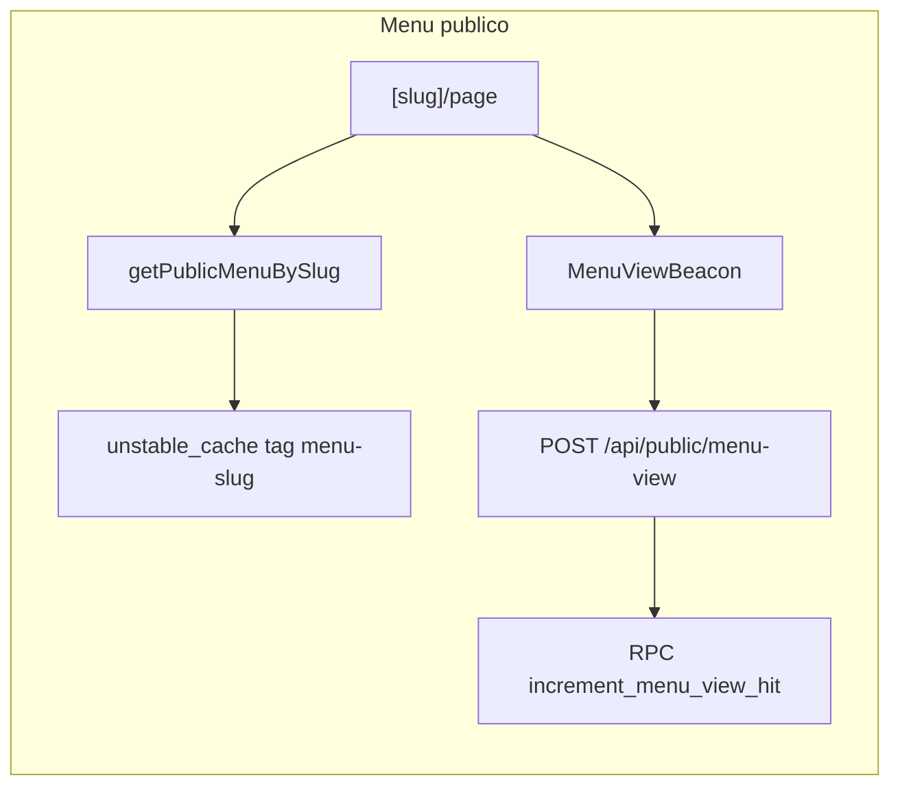

# Mapa para agentes — Menú al Día

Índice corto del producto y del código. No sustituye leer el archivo que vas a tocar; sirve para orientarte en menos de 2 minutos.

Antes de escribir código Next.js: lee `AGENTS.md` y, si aplica, `node_modules/next/dist/docs/`.

## Qué es

SaaS multi-tenant (México): menú digital por slug, menú del día, flyers/WhatsApp, pedidos por `wa.me` y CRM en Pro. Superadmin gestiona tenants, precios, IA y landing.

Planes (`lib/plans.ts`): `catalog` | `daily` | `pro`.

## Carpetas

| Ruta | Rol |
|------|-----|
| `app/` | App Router: páginas + API |
| `components/` | UI por superficie (`admin/`, `public/`, `super-admin/`, `marketing/`, `ui/`) |
| `lib/` | Dominio + `lib/supabase/` (server / client / admin / public) |
| `supabase/migrations/` | Schema 001…041 |
| `stores/` | Estado cliente (p. ej. carrito) |
| `middleware.ts` | Solo refresca sesión en `/admin` y `/super-admin` |

## Superficies

- **Admin tenant** — `app/admin/*` · gate `lib/admin-session.ts` (`requireTenantSession`) · sesión `getSessionRestaurant` en `lib/restaurant.ts` (React `cache()` por request).
- **Menú público** — `app/(public)/[slug]/*` · UI `components/public/*`.
- **Superadmin** — `app/super-admin/(console)/*` · gate `lib/super-admin.ts` / `isCurrentUserSuperAdmin`.
- **Landing marketing** — `app/page.tsx` · CMS `lib/landing-content.ts` · eventos `lib/landing-events.ts`.
- **Ticket pedido** — `app/t/[token]/` · `lib/public-order.ts`.

API: `app/api/admin/*`, `app/api/public/*`, `app/api/super-admin/*`, más `api/orders/log`, `api/revalidate`, `api/cron/*`.

## Dominios → archivos

| Dominio | Entrar por |
|---------|------------|
| Restaurant / menú público + caché | `lib/restaurant.ts` |
| Cupos y settings IA | `lib/ai-quota.ts`, `lib/gemini.ts`, `app/api/admin/ai/*`, `app/api/super-admin/ai/` |
| Planes / features | `lib/plans.ts` |
| Pedidos WA / mensaje | `lib/whatsapp.ts`, `components/public/cart-sheet.tsx`, `app/api/orders/log/` |
| Fulfillment (envío, cotizar, comedor) | `lib/fulfillment.ts`, settings admin |
| FAQs del menú | `app/api/admin/faqs/`, `components/public/menu-faqs.tsx` (van en el caché del menú) |
| CRM clientes | `app/admin/customers/`, `components/admin/customers-crm.tsx` |
| Analytics tenant | `app/admin/analytics/`, `lib/analytics-queries.ts` |
| Notificaciones admin | `components/admin/notification-bell.tsx` → `app/api/admin/notifications/` |
| Búsqueda con intención | `lib/menu-intent.ts`, `app/api/public/menu-intent/`, `components/public/public-menu-search.tsx` |
| Tipos | `lib/types.ts` |

## Flujos críticos

1. **Sesión admin** — middleware Supabase en `/admin` → `requireTenantSession` → `getSessionRestaurant` (Auth + members + restaurant; dedupe por request).
2. **Menú público** — `getPublicMenuBySlug` → caché 1h (restaurante, categorías, platos, combos, menú del día, FAQs activas). Invalidar con `revalidateTag(menuCacheTag(slug), "max")`.
3. **Vista de menú** — `MenuViewBeacon` (`keepalive: true`) → una RPC `increment_menu_view_hit` (migración `041`; día + hora CDMX).
4. **Cupo imagen IA** — `reserveImageUsage` / `assertAiAllowed` en `lib/ai-quota.ts`; settings de plataforma cacheados ~45s con tag `platform-settings`. Generación: `lib/gemini.ts` (imagen: retry solo 429).
5. **Landing event** — `trackLanding*` → `POST /api/public/landing-event`; Auth/superadmin solo si hay cookie de sesión probable.

## Tags de caché (exactos)

| Tag | Origen | Invalidar en |
|-----|--------|--------------|
| `menu-${slug}` | `menuCacheTag()` en `lib/restaurant.ts` | `app/api/revalidate`, `app/api/admin/faqs`, cambios tenant SA |
| `platform-settings` | `PLATFORM_SETTINGS_TAG` en `lib/ai-quota.ts` | PATCH `app/api/super-admin/ai` (cuotas/packs/pause) |
| `landing-content` | `LANDING_CONTENT_TAG` en `lib/landing-content.ts` | PATCH `app/api/super-admin/settings` si `key === landing_content` |

Firma Next 16 en este repo: `revalidateTag(tag, "max")` (dos argumentos).

## Dónde tocar (tareas frecuentes)

| Quiero… | Archivos |
|---------|----------|
| Cambiar qué va en el menú cacheado | `fetchPublicMenuBySlug` en `lib/restaurant.ts` |
| Invalidar menú tras edición admin | Clientes llaman `/api/revalidate`; FAQs ya revalidan en su route |
| Ajustar límites IA por plan | `lib/plans.ts` + UI/API superadmin IA |
| Modo envío / cotizar / comedor | `lib/fulfillment.ts`, `lib/business-labels.ts`, settings + `cart-sheet` |
| Polling notificaciones | `notification-bell.tsx` (interval solo si `visibilityState === "visible"`) |
| Nueva migración SQL | Siguiente número tras `041_…` en `supabase/migrations/` |

## Migraciones

Últimas relevantes: `039` fotos IA producto · `040` shipping on quote · **`041` increment_menu_view_hit**. Aplicar en orden en Supabase; el código de vistas asume `041`.

## Criterios al cambiar

- No romper UX de herramientas existentes (mismos botones/cupos visibles) salvo pedido explícito.
- No exponer `internal_notes` ni datos de superadmin al menú público / sesión tenant.
- Preferir comentarios JSDoc solo en bordes no obvios (billing, seguridad, compat schema); este mapa cubre el “por qué global”.
